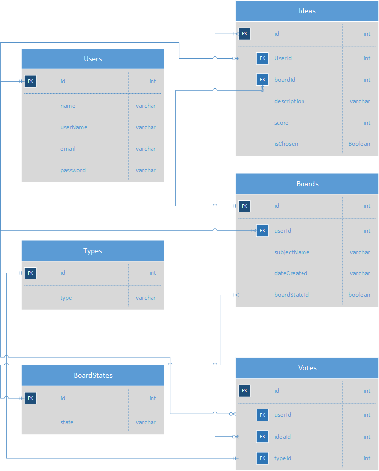

# Votepad
Capstone project where users can submit and vote for ideas in different subjects.

### Technologies used:
* react.js
* moment.js
* alertify.js
* react-dom.js
* react-router-dom.js
* bootstrap.js
* reactstrap.js
* json

### Setup Instructions

1. Install the following npms above.

2. Run the json database with the command 'json-server -p 5002 -w database.json'

3. Run using the 'npm start' command.

### Using the website

Votepad's features are not available until you log in or register. Once it detects a known user, the site will redirect to the home page, where the boards with the most ideas are displayed.

Once you join the board, several things can be done depending on the situation. If you are the board creator, you may change the subject and board status at any time, as well as approve of ideas. If you aren't the board's creator, you may submit ideas and vote on other ideas, depending on the board status.

The navbar on the top-left will expand upon a click, opening to a number of options. My Boards will list the boards that you have set up. This is also where new boards can be created. Board List will list out everybody else's boards to join. My Ideas will display a list of ideas, their votes, and a button to join the board they belong to.

### Documentation

[Votepad Capstone Proposal Documentation](https://docs.google.com/document/d/15LHspgiqUVAaQHOkVmZst-iIOrlyH_QitRDOgP9_PEs "Votepad Capstone Proposal Documentation")

### ERD Diagram

### Data Relationships

### Wireframe

